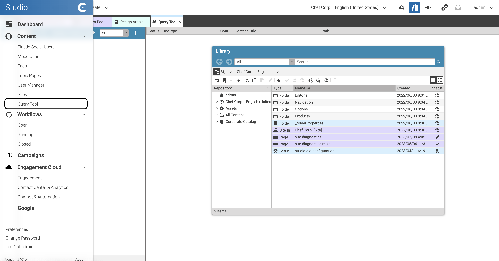
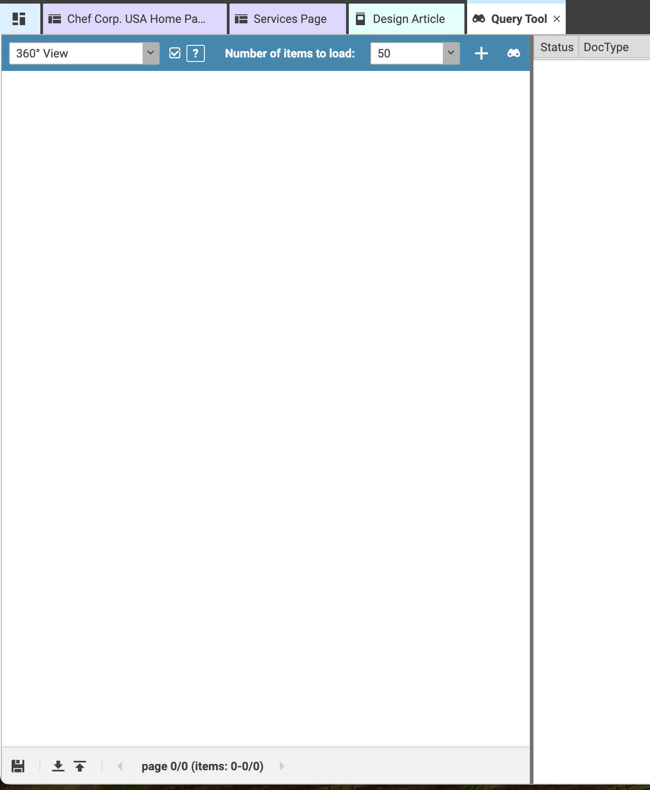
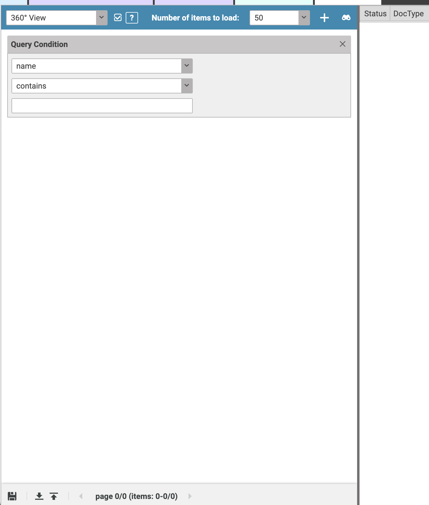
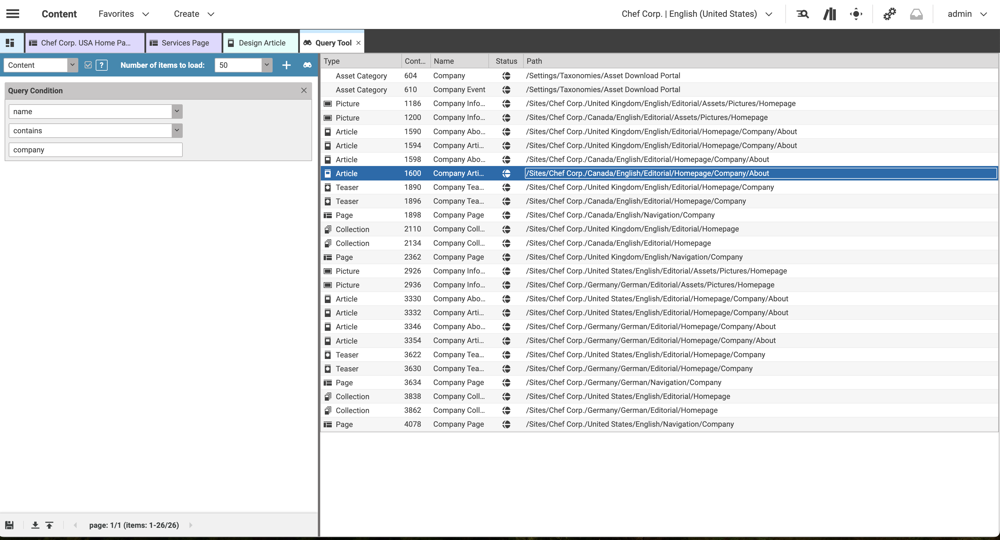

# Editorial Quick Start

--------------------------------------------------------------------------------

\[[Up](README.md)\] \[[Top](#top)\]

--------------------------------------------------------------------------------

## Table of contents

* [Introducing](#introducing)
* [Query Builder](#query-builder)
* [Query Builder Condition](#query-builder-condition)

## Introducing

The query service plugin enables access to the CoreMedia Query Service within Studio, allowing for synchronous and structured queries against the content repository. These queries utilize the CoreMedia Query Language.

Once you've deployed the query service plugin, you can access it through the sidebar of the Studio start menu (see screenshot below) 

## Query Builder
The entry point for the query builder is the menu at the top. From the menu bar, you can choose the content type for your query and set the result limit. Use the plus sign to add query conditions.

## Query Builder Condition
A query condition lets you define a requirement for a specific property of the content type. You can add multiple query conditions as needed.

## Query Results
Once you've created a query as show above, you can click the search button with the binoculars icon.

